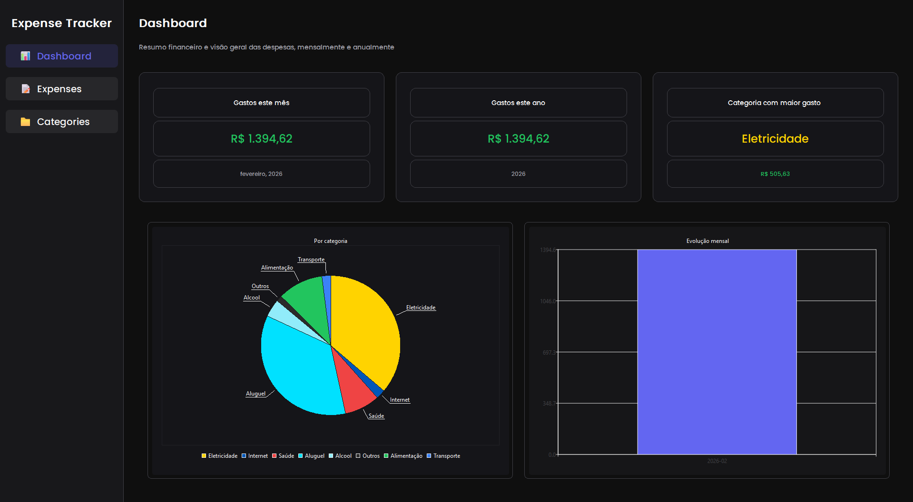

# Expense Tracker

Aplicação desktop para gerenciar algumas despesas pessoais, com banco de dados local, visual moderno, categorias personalizadas, limites por categoria e exportação em CSV/PDF.

## Aplicação em uso




## Requisitos

- Python 3.9+
- PyQt6, PyQt6-Charts, SQLAlchemy, reportlab

## Instalação

```bash
cd "expense tracker"
pip install -r requirements.txt
python main.py
```

## Estrutura do projeto

```
expense tracker/
├── main.py              
├── app/                  # Configuração basica
├── core/                 # Banco, modelos, repositório
├── services/             # Middleware para o banco (despesas, categorias, export)
├── ui/                   
│   ├── main_window.py    
│   ├── styles/           
│   └── views/            
├── data/                 
├── exports/              # CSV/PDF exportados (criado automaticamente)
└── resources/fonts/      
```

## Banco de dados

Os dados são salvos localmente em `data/expense_tracker.db` (SQLite). por padrão são criadas categorias base no arquivo `core/database.py` é possivel mudar as cores das categorias, adicionar mais, ou menos.
